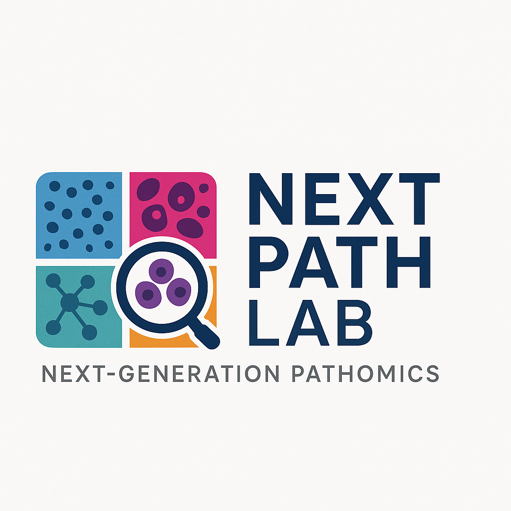

## ~Pioneering the next generation of pathology informatics~ :D 

NextPath Lab advances next-generation pathomics by combining cancer biology, digital pathology, and spatial data science. We develop computational methods that transform cell- and tissue-level imaging into quantitative biomarkers, enabling earlier detection of aggressive lesions and deeper understanding of tumor micro-environments. Our work spans machine learning, graph-based modeling, and high-dimensional spatial biology, with a focus on building interpretable tools that bridge histopathology and molecular phenotype. Through collaborative, data-driven research, we aim to push the boundaries of precision oncology and create scalable technologies that improve patient prognostication and clinical decision-making.

[GitHub](https://github.com/NextPath-Lab) | [Guillaud Lab](https://www.bccrc.ca/dept/io/labs/guillaud-lab) | [MacAulay Lab](https://www.bccrc.ca/dept/io/labs/macaulay-lab)  

## Current Opportunities

Coming soon!

[Learn about our research →](/research/research_index.md)

