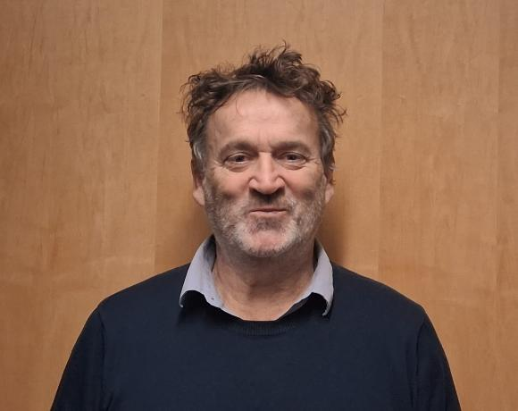
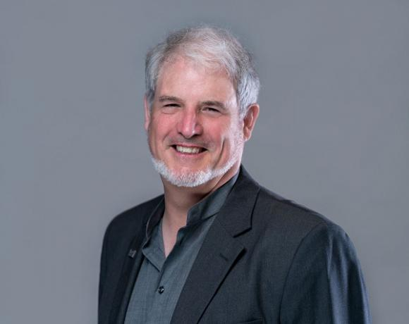

# Lab Members

## **Principal Investigators**
## Dr. Martial Guillaud, PhD

In addition to serving as a Senior Scientist at the BC Cancer Research Centre, Dr. Guillaud is an Assistant Professor in the UBC Department of Pathology and Laboratory Medicine and Adjunct Professor in the UBC Department of Statistics. He has previously provided instruction in data analysis, image analysis, and computer science at the Joseph Fourier University (Biological Sciences), Stendhal University (Social Sciences), and the French Institute National of Health and Medical Research (INSERM). He completed his PhD in the field of Biological and Medical Informatics at Joseph Fourier University, developing new statistical and image analysis techniques that could be applied to tissue biopsy cross-sections to determine patient prognosis and diagnosis. He also completed a master’s degree in Cellular Biology (Animal Genetics) at Clermont Ferrand University. Dr. Guillaud holds patents on multiple techniques for automated assessment of tissue specimens and has authored dozens of research manuscripts in the areas of biostatistics and image processing.

## Dr. Calum MacAulay, PhD

Born in Halifax, Dr. MacAulay has lived and worked in Vancouver for over 30 years. His formal training includes a BSc in Engineering Physics (1982) from Dalhousie University, an MSc in Physics (1985) from Dalhousie University, and a PhD in Physics (1989) from the University of British Columbia. Dr. MacAulay is also currently an Associate Member of the Department of Physics and Astronomy and a Clinical Associate Professor in the Department of Pathology at the University of British Columbia. He has been awarded i) the BC Lung Association Scholar (1990-1995), ii) the Friesen-Rygiel Prize for outstanding Canadian academic discovery leading to uniquely positioned commercialization opportunities (1999), and iii) the Young Innovator Award, BC Science and Technology Award, Science Council of BC (1999). 

## **Staff**

## **Students**
